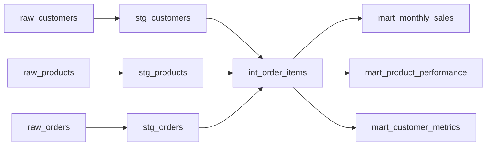
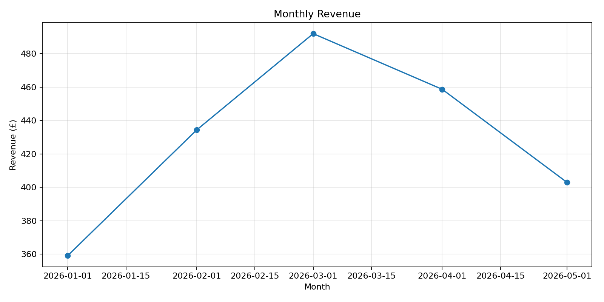
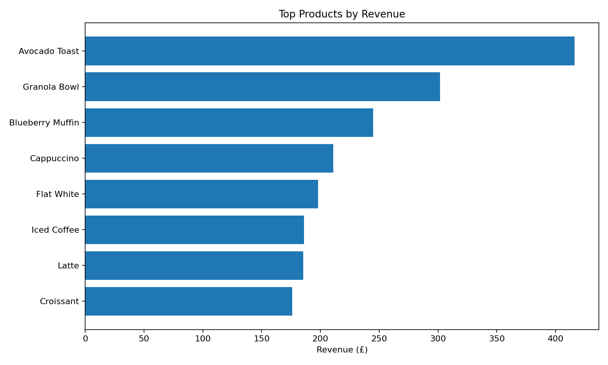
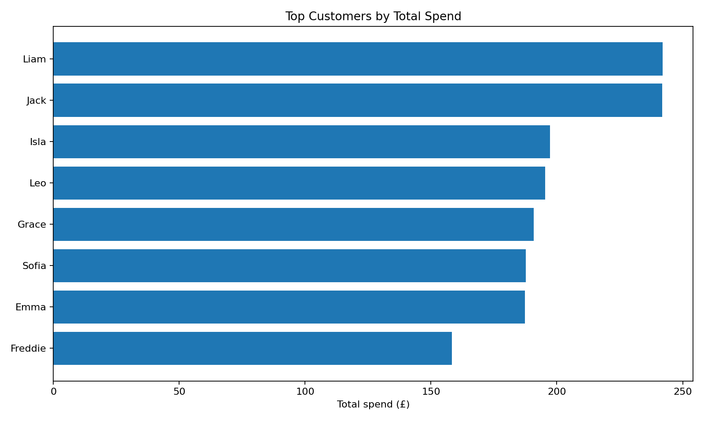

# dbt Sales Analytics

A beginner-friendly analytics engineering project using **dbt**, **SQL** and **DuckDB** to transform raw coffee shop sales data into clean reporting tables.

The project demonstrates a standard dbt workflow:

**Raw data → Staging models → Intermediate model → Analytics marts → Charts**

## Project Summary

This project starts with three raw CSV files:

- customers
- products
- orders

Using dbt, the raw data is cleaned, joined and transformed into business-ready marts for sales, product and customer analysis.

## Key Skills Demonstrated

- Structured a dbt project using staging, intermediate and mart layers
- Loaded raw CSV data as dbt seeds
- Wrote SQL transformations using `ref()`
- Created data quality tests for uniqueness, missing values, accepted values and relationships
- Built final analytics tables for reporting
- Generated charts from final mart tables
- Documented model purpose and project workflow

## Tools Used

- dbt Core
- dbt-duckdb
- DuckDB
- SQL
- Python
- pandas
- matplotlib

## Project Structure

```text
.
├── data/raw/                 # Raw CSV seed files
├── models/
│   ├── staging/              # Cleaned source-level models
│   ├── intermediate/         # Joined order item model
│   └── marts/                # Final reporting tables
├── analyses/                 # Example analysis/export scripts
├── docs/                     # Project flow documentation
├── outputs/
│   ├── charts/               # Generated visual outputs
│   └── tables/               # Exported final marts
├── dbt_project.yml
├── profiles.yml
└── requirements.txt
```

## dbt Model Flow



## Final Mart Tables

### `mart_monthly_sales`
Monthly sales metrics including total orders, items sold, revenue and average order value.

### `mart_product_performance`
Product-level performance including items sold, revenue and order count.

### `mart_customer_metrics`
Customer-level metrics including total orders, total spend, average order value and first/latest order dates.

## Data Quality Tests

The project includes dbt tests for:

- unique IDs
- non-null key fields
- valid sales channels
- relationships between orders, customers and products

Latest local run:

```text
dbt build completed successfully
PASS=35 WARN=0 ERROR=0 SKIP=0 TOTAL=35
```

## Charts

### Monthly Revenue



### Top Products by Revenue



### Top Customers by Spend



## How to Run Locally

Create and activate a virtual environment:

```bash
python3 -m venv .venv
source .venv/bin/activate
```

Install requirements:

```bash
pip install -r requirements.txt
```

Run dbt seed and build:

```bash
DBT_PROFILES_DIR="$PWD" dbt seed
DBT_PROFILES_DIR="$PWD" dbt build
```

Generate dbt docs:

```bash
DBT_PROFILES_DIR="$PWD" dbt docs generate
DBT_PROFILES_DIR="$PWD" dbt docs serve
```

Export marts and create charts:

```bash
MPLCONFIGDIR=.cache/matplotlib XDG_CACHE_HOME=.cache python analyses/export_marts_and_charts.py
```

## What I Practised

- Separating raw, staging, intermediate and mart layers
- Writing reusable SQL transformations
- Using dbt tests to check data quality
- Creating simple reporting tables
- Turning final marts into visual outputs
- Documenting an analytics engineering workflow clearly

## Next Improvements

- Add more advanced SQL metrics
- Add snapshots for slowly changing customer data
- Add exposures for dashboard/report dependencies
- Create a small BI dashboard from the final marts
