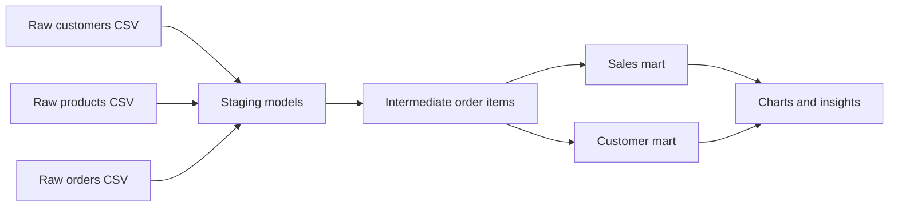

# Project Flow

```mermaid
flowchart LR
    A[Raw customers CSV] --> D[Staging models]
    B[Raw products CSV] --> D
    C[Raw orders CSV] --> D
    D --> E[Intermediate order items]
    E --> F[Sales mart]
    E --> G[Customer mart]
    F --> H[Charts and insights]
    G --> H
```

This project uses dbt to transform raw sales data into clean analytics tables. The final marts are used to answer simple business questions about revenue, products and customers.
